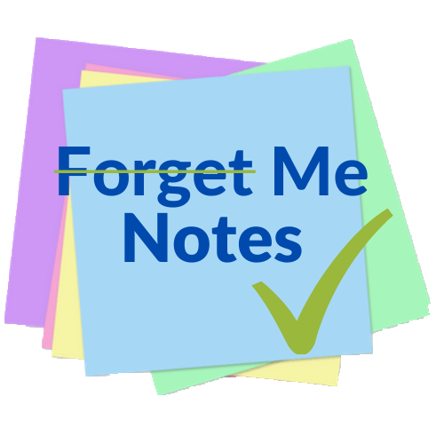

[![Forks][forks-shield]][forks-url]
[![Stargazers][stars-shield]][stars-url]
[![Issues][issues-shield]][issues-url]
[![MIT License][license-shield]][license-url]
[![LinkedIn][linkedin-shield]][linkedin-url3]
[![LinkedIn][linkedin-shield]][linkedin-url1]
[![LinkedIn][linkedin-shield]][linkedin-url2]
[![LinkedIn][linkedin-shield]][linkedin-url]
<!--ReactSkipperStart -->

<h1>Forget Me Not(es) </h1>
<br />
<p align="center"  style='margin-top: -40px; margin-bottom: -10px;'>
  <a href="https://github.com/rhwebster/forgetMeNot">
    
  </a>

  <p align="center">
    <b>Forget Me Not(es)</b> an App Academy Student Group Project and a clone of Remember The Milk, a To-do list app
    <br />
    <br />
    <a href="https://github.com/rhwebster/forgetMeNot/wiki"><strong>Explore the docs »</strong></a>
    <br />
    <br />
    <a href="https://forget-me-not-aa.herokuapp.com/">View Demo/Live</a>
    ·
    <a href="https://github.com/rhwebster/forgetMeNot/issues">Report Bug</a>
    ·
    <a href="https://github.com/rhwebster/forgetMeNot/issues">Request Feature</a>
  </p>
</p>


<details open='open'>
   <summary>Table of Contents</summary>
   <ol style='margin: 0px 30px 0px 0px'>
      <li>
         <a href="#about-the-project">About The Project</a>
         <ul>
            <li><a href="#what-is-the-project">What is the project</a></li>
            <li><a href="#technologies">Technologies</a></li>
         </ul>
      </li>
      <li>
         <a href="#getting-started">Getting Started</a>
         <ul>
         <li><a href="#prerequisites">Prerequisites</a></li>
         <li><a href="#installation">Installation</a></li>
         </ul>
      </li>
      <li><a href="#usage">Usage</a>
         <ul>
            <li><a href="#more-screenshots">More Screenshots</a></li>
         </ul>
      </li>
      <li><a href="#roadmap">Roadmap</a></li>
      <li><a href="#contributing">Contributing</a></li>
      <li><a href="#license">License</a></li>
      <li><a href="#acknowledgements">Acknowledgements</a></li>
   </ol>
</details>


## About The Project
### What is the project

 **Forget Me Not(es)** an App Academy Student Group Project and a clone of Remember The Milk, is a to-do list platform that allows users to record (everyday) tasks so they can remember what to do and organize their days. Tasks have, among other properties, priority levels, due dates and tags so users can immediately know their importance and act accordingly. Users can also create lists to organize their tasks, and can also share or assign the tasks with/to other users (friends).
<!--ReactSkipperEnd -->

<!--ReactSkipperStart -->
<details open="open">
   <summary>Screenshots: Login and Homepage</summary>
   <div style="display: flex">
      
      
   <div>
</details>


### Technologies
**For Get Me Not** uses the following technologies and languages:

* JavaScript, NodeJS and ES6
  - Express Server
  - BScript for token and password hashing
  - dotenv
  - PUG
  - HTML (DOM)

* REST
  - RESTful route scheme

* PostgreS & SQL
  - psql
  - sequelize
<!--ReactSkipperEnd -->

## Getting Started

To get a local copy up and running follow these steps.

### Prerequisites

Install npm on your local computer
* npm
  ```sh
  npm install npm@latest -g
  ```

### Installation
1. Clone this repository (only this branch)

   ```bash
   git clone https://github.com/rhwebster/forgetMeNot.git
   ```

2. Install dependencies

      ```bash
      npm install
      ```

3. [Further steps here](https://github.com/rhwebster/forgetMeNot/wiki)

## Usage
_For more examples, please refer to the [Documentation](https://github.com/rhwebster/forgetMeNot/wiki)_


## Roadmap

See the [open issues](https://github.com/rhwebster/forgetMeNot/issues) for a list of proposed features (and known issues).


## Contributing

Contributions are what make the open source community such an amazing place to be learn, inspire, and create. Any contributions you make are **greatly appreciated**.

1. Fork the Project
2. Create your Feature Branch (`git checkout -b feature/AmazingFeature`)
3. Commit your Changes (`git commit -m 'Add some AmazingFeature'`)
4. Push to the Branch (`git push origin feature/AmazingFeature`)
5. Open a Pull Request


## License

Distributed under the MIT License. See `LICENSE` for more information.


## Acknowledgements

* [App Academy](https://www.appacademy.io/)
* [Best-README-Template](https://github.com/othneildrew/Best-README-Template)


[contributors-shield]: https://img.shields.io/github/contributors/rhwebster/forgetMeNot.svg?style=for-the-badge
[contributors-url]: https://github.com/rhwebster/forgetMeNot/graphs/contributors
[forks-shield]: https://img.shields.io/github/forks/rhwebster/forgetMeNot.svg?style=for-the-badge
[forks-url]: https://github.com/rhwebster/forgetMeNot/network/members
[stars-shield]: https://img.shields.io/github/stars/rhwebster/forgetMeNot.svg?style=for-the-badge
[stars-url]: https://github.com/rhwebster/forgetMeNot/stargazers
[issues-shield]: https://img.shields.io/github/issues/rhwebster/forgetMeNot.svg?style=for-the-badge
[issues-url]: https://github.com/rhwebster/forgetMeNot/issues
[license-shield]: https://img.shields.io/github/license/rhwebster/forgetMeNot.svg?style=for-the-badge
[license-url]: https://github.com/rhwebster/forgetMeNot/blob/master/LICENSE.txt
[linkedin-shield]: https://img.shields.io/badge/-LinkedIn-black.svg?style=for-the-badge&logo=linkedin&colorB=555
[linkedin-url3]: https://www.linkedin.com/in/ryan-webster-a784509b/
[linkedin-url1]: https://www.linkedin.com/in/daniel-miller-970393178/
[linkedin-url2]: https://www.linkedin.com/in/lane-smit-724291203/
[linkedin-url]: https://www.linkedin.com/in/tony-ngo-m/
